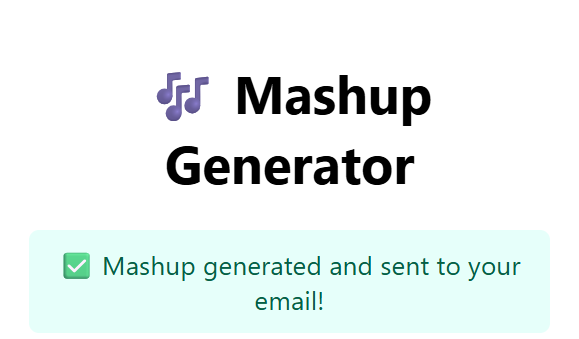

# 🎵 Mashup Generator – CLI & Web Service

This project implements a **Mashup Generator** as part of the assignment requirements.  
It consists of:

- **Program 1**: A command-line Python application
- **Program 2**: A Flask-based web service with email delivery

The system downloads YouTube videos of a given singer, extracts audio clips, trims them, merges them into a mashup, and delivers the result as a ZIP file.

---

## 📁 Project Structure

```
Mashup_Assignment/
│
├── Screenshots/
│ ├── Confirmation.png
│ ├── Email_Response.png
│ └── Web-service.png
│
├── web_app/
│ ├── app.py
│ ├── templates/
│ │ └── index.html
│ └── static/
│ └── style.css
│
├── 102303773.py
├── requirements.txt
├── README.md
└── .gitignore
```

---

## 🖥️ Program 1: Command Line Mashup Generator

### 🔹 Features

- Downloads **N YouTube videos** of a given singer
- Converts videos to audio
- Trims the **first Y seconds** from each audio file
- Merges all trimmed clips into a **single mashup**
- Validates inputs and handles errors gracefully

### ▶️ Usage

```bash
python 102303773.py "<SingerName>" <NumberOfVideos> <AudioDuration> <OutputFileName>
```

---

## 📌 Example

```bash
python 102303773.py "Arijit Singh" 12 30 mashup.mp3
```

---

### ⚠️ Constraints

- Number of videos must be **greater than 10**
- Audio duration must be **greater than 20 seconds**

---

## 🌐 Program 2: Web Service (Flask Application)

This program provides a web-based interface for generating the mashup and delivering it to the user via email.

### 🔹 Features

- Web interface built using **HTML and CSS**
- User inputs:
  - Singer name
  - Number of videos
  - Duration (in seconds)
  - Email ID
- Backend executes the command-line mashup program
- Generated mashup is compressed into a **ZIP file**
- ZIP file is sent to the user via **email**

---

### ▶️ Run the Web Application Locally

```bash
cd web_app
python app.py
```

---

## 🧰 Technologies & Libraries Used

- **Python 3**
- **Flask** – for building the web service
- **yt-dlp** – for downloading YouTube videos
- **pydub** – for audio trimming and merging
- **ffmpeg** – for audio processing
- **SMTP (Gmail App Password)** – for sending emails with attachments

Install all required dependencies using:

```bash
pip install -r requirements.txt
```

---

## 📸 Screenshots

### 🔹 Web Service Interface


### 🔹 Mashup Generation Confirmation



### 🔹 Email with ZIP Attachment

## 

## 🎓 Assignment Summary

- Implemented a **command-line mashup generator** using Python
- Downloaded YouTube videos and extracted audio using `yt-dlp`
- Trimmed audio clips and merged them into a single mashup using `pydub` and `ffmpeg`
- Added proper **input validation** and **error handling**
- Developed a **Flask-based web service** for user interaction
- Designed a clean **HTML + CSS frontend**
- Generated mashup files dynamically and compressed them into a **ZIP archive**
- Sent the ZIP file to the user via **email (SMTP)**
- Included screenshots as proof of successful execution
- Provided complete documentation and source code in the repository

---

## 👤 Author

- **Name:** Sameer Rai
- **Roll Number:** 102303773
- **Assignment Title:** Mashup Generator

---
